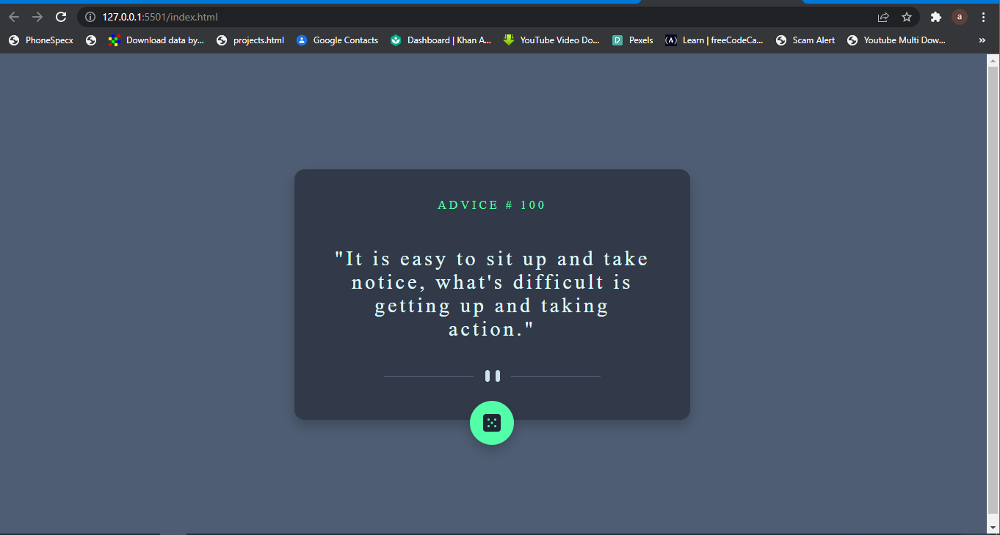
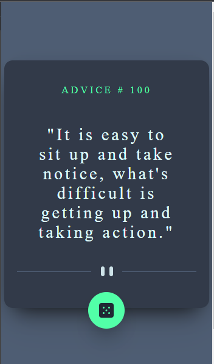

# Frontend Mentor - Advice generator app solution

This is a solution to the [Advice generator app challenge on Frontend Mentor](https://www.frontendmentor.io/challenges/advice-generator-app-QdUG-13db). Frontend Mentor challenges help you improve your coding skills by building realistic projects.

## Table of contents

- [Overview](#overview)
  - [The challenge](#the-challenge)
  - [Screenshot](#screenshot)
  - [Links](#links)
- [My process](#my-process)
  - [Built with](#built-with)
  - [What I learned](#what-i-learned)
  - [Continued development](#continued-development)
  - [Useful resources](#useful-resources)
- [Author](#author)
- [Acknowledgments](#acknowledgments)

**Note: Delete this note and update the table of contents based on what sections you keep.**

## Overview

The project is to give you an idea on how to fetch data from an api and display the data locally. It gives a brief into the process of positioning elements as well. At the end of the challenge I was able to achieve all the necessary requirements.

### The challenge

Users should be able to:

- Click and update the advice quote with its respective number.
- Also get a responsive design, I.e to view the irrespective of their device

  All the challenges were perfectly achieved

### Screenshot




### Links

- Solution URL: [Add solution URL here](https://your-solution-url.com)
- Live Site URL:(https://github.com.io/Abdech/advice-generator-app-main-advice-generator-app-main-Frontend-Mentor)

## My process

### Built with

- Semantic HTML5 markup
- CSS custom properties
- Flexbox

### What I learned

I have idea on the use of API, I even once used it in a tutorial video but making use of it on my own her actually reinforced my knowledge about Fetch.

I am really proud of the async await that I used but when I thought of browser compartability i decided to just use the fetch, .then and .catch

```js
fetch().then().catch();
```

I just comment it out in the js which can be uncommented in the future.

```js
async function advicer() {
  const res = await fetch("https://api.adviceslip.com/advice");
  const { slip } = await res.json();
  console.log(slip);
  quoteNo.innerHTML = `${slip.id}`;
  theQuote.innerHTML = `"${slip.advice}`;
}
```

### Continued development

The next area I want to focus is how to make more responsive features and am also thinking of adding some fun animations to the site to make more lifely.

### Useful resources

- [Example resource 1](https://www.example.com) - This helped me for XYZ reason. I really liked this pattern and will use it going forward.
- [Example resource 2](https://www.example.com) - This is an amazing article which helped me finally understand XYZ. I'd recommend it to anyone still learning this concept.

## Author

- Website - [Abdulaziz Saad](https://github.com/Abdech/Main_portfolio)
- Frontend Mentor - [@abdech](https://www.frontendmentor.io/profile/abdech)
- Twitter - [@azizsaadu](https://www.twitter.com/azizsaadu)
  
